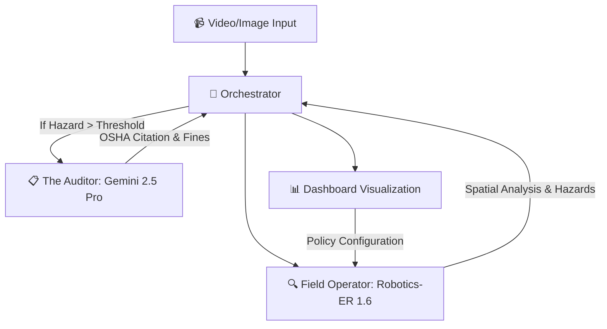

# 🛡️ SafeOps

### Multi-Agent Industrial Safety Intelligence Powered by Gemini Robotics-ER 1.6 & Gemini 2.5 Pro


SafeOps transforms industrial monitoring into an autonomous safety team. By orchestrating a pipeline of specialized Gemini agents, the system doesn't just "see" hazards—it reasons about physics, understands legal compliance, and operates as an autonomous economic entity.

> **Track 3: Robotics & Simulation** — TechEx Intelligent Enterprise Solutions Hackathon

---

## 🧠 Multi-Agent Architecture (The SafeOps Squad)

SafeOps uses a **"Squad-based"** AI approach, where each agent is a specialist powered by a different Gemini model variant:

| Agent | Model | Mission |
|---|---|---|
| **🔍 Field Operator** | **Robotics-ER 1.6** | **The Eyes:** Visual perception, spatial reasoning, trajectory prediction, gauge reading, and robot function calling. |
| **📋 The Auditor** | **Gemini 2.5 Pro** | **The Brain:** OSHA compliance analysis, citation of specific 29 CFR regulations, and financial exposure calculations. |
| **🚀 Orchestrator** | **Python Logic** | **The Glue:** Coordinates the hand-off between agents and maintains the mission pipeline log. |
| **💰 Financial Agent** | **X402 (Backlog)** | **The Payer:** Automates "Machine-to-Machine" payments for API usage and audit services via Arc Network. |

---

## ✨ Key Features

| Feature | Technology |
|---|---|
| 📐 **Spatial AI Reasoning** | Gemini Robotics-ER understanding of distances, trajectories, and physical consequences. |
| 📋 **OSHA Compliance Audit** | Gemini 2.5 Pro citing specific 29 CFR standards for every detected hazard. |
| 🤖 **Robot Response** | Function calling to orchestrate safety robot actions (Stop machine, alert personnel, etc). |
| 📈 **Financial Impact** | Accurate potential fine and liability calculations powered by the Auditor agent. |
| 🔧 **Gauge/Meter Reading** | Analog instrument reading via code execution. |
| 🔐 **Policy Governance** | User-defined safety thresholds injected as "Ground Truth" for all AI reasoning. |
| 🚀 **Start Operation** | Manual trigger to prepare sources and policies before launching AI analysis. |

---

## 🏗️ System Flow



---

## 🛠️ Tech Stack

| Layer | Technology |
|---|---|
| **Visual Core** | Gemini Robotics-ER 1.6 (`gemini-robotics-er-1.6-preview`) |
| **Audit Core** | Gemini 2.5 Pro (`gemini-2.5-pro-preview-06-05`) |
| **Backend** | Python 3.11+ / FastAPI / WebSockets |
| **Frontend** | React 19 / Vite / HTML5 Canvas |
| **Policy Store** | Dynamic JSON Policy Engine |
| **Infrastructure** | Google AI Studio / Vertex AI |

---

## 🚀 Quick Start

### 1. Backend

```bash
cd backend
python -m venv venv
venv\Scripts\activate          # Windows
pip install -r requirements.txt

# Create your .env file and add your GEMINI_API_KEY
copy .env.example .env

python main.py
```

### 2. Frontend

```bash
cd frontend
npm install
npm run dev
```

### 3. Operation Flow

1.  **Configure:** Use the **⚙️ Policy** button to set your plant's safety thresholds.
2.  **Add Sources:** Upload up to 4 images/videos to the view slots.
3.  **Start:** Click **🚀 START OPERATION** to trigger the agent pipeline.
4.  **Audit:** View the **Agent Pipeline** log to see how the Operator and Auditor collaborated.

---

## 📸 Demo Scenarios

*   **PPE Compliance:** Operator detects missing helmet; Auditor cites **29 CFR 1910.135** and estimates a **$15,625 fine**.
*   **Collision Risk:** Operator predicts forklift/worker intersection; Auditor identifies **29 CFR 1910.178** violation.
*   **Gauge Anomaly:** Operator reads 85°C; Auditor flags as critical per Policy and suggests immediate machine stop.

---

## 📁 Project Structure

```
SafeOps/
├── backend/
│   ├── agents/
│   │   ├── field_operator.py  # Robotics-ER Logic
│   │   ├── auditor.py         # Gemini Pro / OSHA Logic
│   │   └── orchestrator.py    # Agent Coordination
│   ├── main.py                # FastAPI entry
│   ├── safety_policy.json     # Dynamic Policy Engine
│   └── osha_knowledge_base.md # Context for Auditor
├── frontend/
│   ├── src/
│   │   ├── App.jsx            # Multi-Agent Dashboard
│   │   └── index.css          # Premium Design System
```

---

**Built for the TechEx Intelligent Enterprise Solutions Hackathon — Track 3: Robotics & Simulation**
